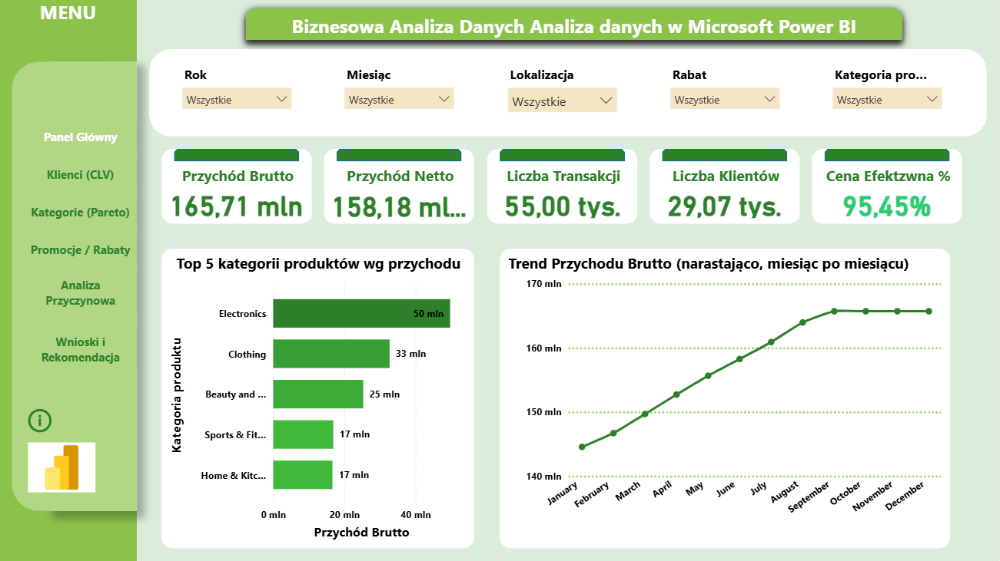
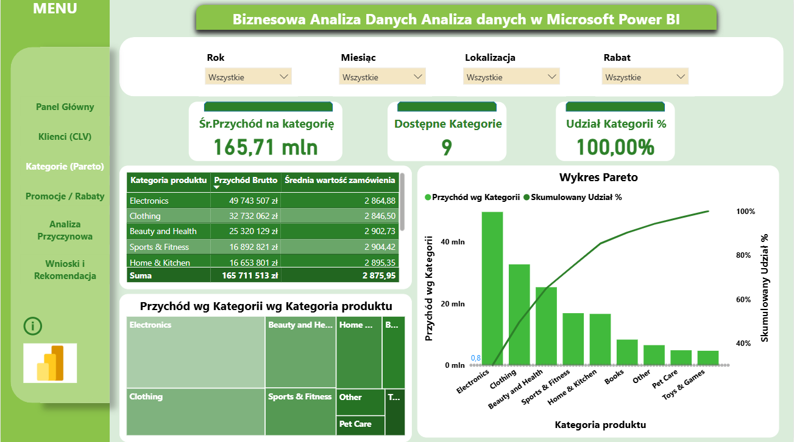
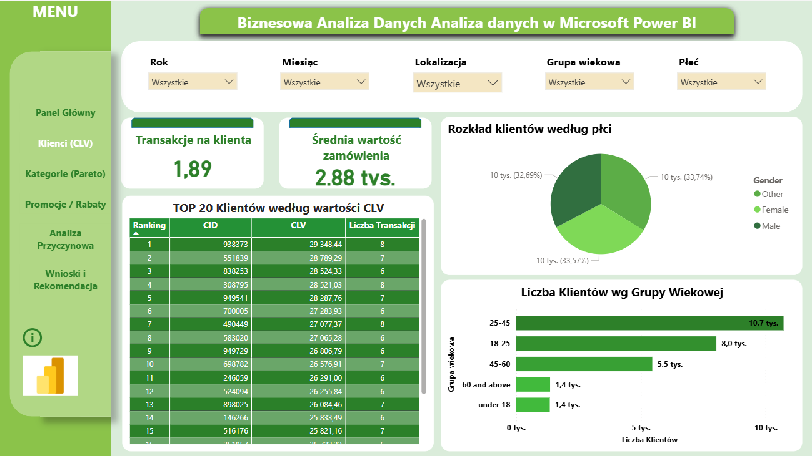

# E-Commerce Sales Dashboard – Microsoft Power BI

> Interaktives Business-Intelligence-Dashboard zur umfassenden Analyse von Online-Shop-Verkaufsdaten (2019–2024).

---

## 🖼️ Dashboard-Vorschau

.png)

---

## 📌 Projektbeschreibung

Dieses Projekt wurde im Rahmen des Moduls **Business Data Analysis** an der **Vizja Universität** realisiert. Ziel war die Entwicklung eines vollständig interaktiven und automatisierten analytischen Dashboards in Microsoft Power BI, um strategische und operative Entscheidungen im E-Commerce-Bereich zu unterstützen.

Das Dashboard deckt den gesamten BI-Lebenszyklus ab:
**ETL-Prozesse → Datenmodellierung (Star-Schema) → DAX-Kennzahlen → Visualisierung → KI-gestützte Analyse**

---

## 📂 Datenbasis

| Merkmal | Wert |
|---|---|
| Quelle | Kaggle – `project1df.csv` |
| Zeitraum | Januar 2019 – Dezember 2024 |
| Datensätze | 55.000 Transaktionen |
| Spalten | 13 |
| Kategorien | 9 Produktkategorien |
| Standorte | 14 Städte |

---

## ⚙️ Technischer Aufbau

### Datenmodell – Star-Schema
Das Modell basiert auf einer optimierten Sternstruktur:
- **F_Sales (Faktentabelle):** Verkaufsdaten und Transaktionen.
- **Dim_Customer:** Kunden-ID, Geschlecht, Altersgruppe.
- **Dim_Product:** Produktkategorien.
- **Dim_Discount:** Rabattbezeichnungen und Status.
- **Dim_Location:** Geografische Daten (14 Städte).
- **Dim_Date:** Kalenderhierarchie.

### ETL & Datenaufbereitung (Power Query)
- Datentyp-Konvertierung i Lokalisierungseinstellungen.
- Qualitätsprüfung: 0 % Fehler i 0 % Leerwerte.
- Erstellung einer `AgeSort`-Hilfsspalte.
- Transformation von `Discount Availed` (Yes/No) in binäre Werte (1/0).

---

## 📐 DAX-Kennzahlen (27 Measures)

- **Basis-KPIs:** Bruttoumsatz, Nettoumsatz, Anzahl der Transaktionen.
- **Time Intelligence:** YoY %, MoM %, YTD, kumulierte Werte.
- **Warenkorbanalyse:** AOV gesamt vs. mit/ohne Rabatt.
- **Kundenwert:** Customer Lifetime Value (CLV), Transaktionen pro Kunde.
- **Pareto-Analyse:** Anteil am Gesamtumsatz i kumulierter Anteil.

---

## 📋 Dashboard-Struktur (7 Seiten)

| Seite | Titel | Inhalt |
|---|---|---|
| 🏠 | Startseite | Projekteinführung und Navigation. |
| 1 | Haupt-KPI-Panel | Umsatzübersicht, Trends und Top-Kategorien. |
| 2 | Kunden – CLV | Kundenwert-Analyse und demografische Segmentierung. |
| 3 | Kategorien – Pareto | 80/20-Analyse der Produktkategorien. |
| 4 | Promotions & Rabatte | Analyse der Rabatteffektivität. |
| 5 | Kausalanalyse (KI) | Key Influencers und Decomposition Tree. |
| 6 | Fazit & Empfehlungen | Strategische Handlungsempfehlungen. |

---

## 📊 Wichtigste Ergebnisse

* **Bruttoumsatz gesamt:** 165,71 Mio.
* **Nettoumsatz:** 158,18 Mio.
* **Umsatzwachstum (YoY):** +16,90 %
* **Pareto-Insight:** Die Top 3 Kategorien (*Electronics, Clothing, Beauty & Health*) generieren **80 % des Gesamtumsatzes**.

---

## 💡 Strategische Empfehlungen

- **Sortiment:** Fokus auf Kategorie A (80% Umsatzanteil).
- **Kundenbindung:** Treueprogramm für Segment 25–45 Jahre.
- **Rabattpolitik:** Schwellenrabatte statt Pauschalrabatte.
- **Expansion:** Übertragung des "Bangalore-Modells" auf andere Standorte.

---

## 🛠️ Tech Stack

- **Microsoft Power BI Desktop**
- **Power Query (M)**
- **DAX**
- **Power BI AI Visuals**

---

## 📁 Repository-Struktur
Datenanalyse-PowerBI-Projekt/
│
├── README.md                           <- Projektdokumentation
├── Datenanalyse-PowerBI-Projekt.pbix   <- Power BI Berichtsdatei
├── PowerBI_Portfolio_DE.docx.pdf       <- Technische Dokumentation (PDF)
├── Fazit & Empfehlungen.png
├── Haupt-KPI-Panel.png
├── Kategorien – Pareto.png
├── Kausalanalyse (KI).png
├── Kunden – CLV.png
├── Promotions & Rabatte.png
└── Startseite.png

## 👩‍💻 Autorin

**Katarzyna Brzeski**
*Vizja Universität – Business Data Analysis*

---
*Projekt realisiert 2024/2025 · Erstellt mit Microsoft Power BI Desktop*
